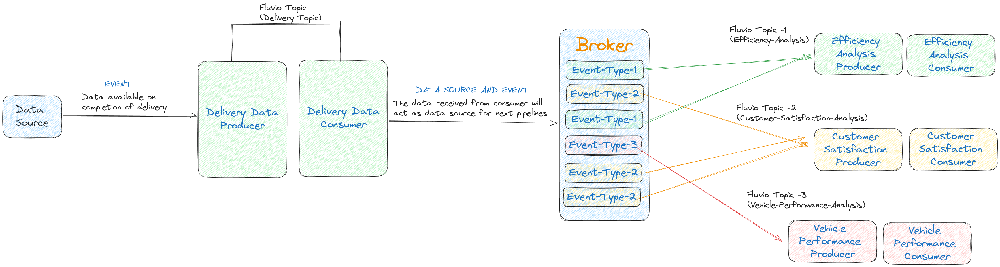

# Zomato Delivery Analysis

An event driven architecture for the Zomato Ops team that could help in analysis of driver logistics with respect to weather, traffic, vehicle type etc.

# Application Architecture

This architecture diagram represents an event-driven system designed to analyze delivery data of Zomato using Fluvio. The architecture is divided into several key components, each responsible for different stages of data processing and analysis.

## 1. Data Source

- **Event Trigger**: The data source emits an event when a delivery is completed. This event includes relevant delivery details such as delivery ID, delivery person information, order details, and environmental conditions.

## 2. Fluvio Topic: `Delivery-Topic`

- **Delivery Data Producer**: The producer publishes delivery data to the `Delivery-Topic` on the Fluvio platform. This data represents the raw information captured when a delivery is completed.
- **Delivery Data Consumer**: The consumer subscribes to the `Delivery-Topic` to consume the delivery data. This consumer processes the data and then acts as a data source for subsequent analysis pipelines.

## 3. Broker

- The broker is responsible for routing different event types to specific Fluvio topics, enabling multiple analysis pipelines to operate concurrently on the processed data.

## 4. Event Types

- **Event-Type-1**: This event type is associated with efficiency analysis.
- **Event-Type-2**: This event type is associated with customer satisfaction analysis.
- **Event-Type-3**: This event type is associated with vehicle performance analysis.

## 5. Fluvio Topics and Analysis Pipelines

- **Fluvio Topic-1: `Efficiency-Analysis`**
  - **Efficiency Analysis Producer**: This producer publishes data to the `Efficiency-Analysis` topic. The data pertains to the efficiency of deliveries, such as time taken, fuel usage, and routing efficiency.
  - **Efficiency Analysis Consumer**: This consumer processes the data from the `Efficiency-Analysis` topic to generate insights into delivery efficiency.
- **Fluvio Topic-2: `Customer-Satisfaction-Analysis`**

  - **Customer Satisfaction Producer**: This producer publishes data to the `Customer-Satisfaction-Analysis` topic. The data includes metrics like customer feedback, delivery ratings, and order accuracy.
  - **Customer Satisfaction Consumer**: This consumer processes the data from the `Customer-Satisfaction-Analysis` topic to evaluate and improve customer satisfaction.

- **Fluvio Topic-3: `Vehicle-Performance-Analysis`**
  - **Vehicle Performance Producer**: This producer publishes data to the `Vehicle-Performance-Analysis` topic. The data involves vehicle-related metrics such as maintenance needs, performance degradation, and fuel efficiency.
  - **Vehicle Performance Consumer**: This consumer processes the data from the `Vehicle-Performance-Analysis` topic to monitor and enhance vehicle performance.

## 6. Data Source and Event Propagation

- The data consumed by each analysis pipeline serves as both a data source for subsequent analyses and as an event trigger for further processing. This design allows for the continuous evolution of insights across different aspects of the delivery process.

This architecture enables a modular and scalable approach to analyzing different facets of delivery operations, with each analysis pipeline focusing on a specific aspect of the delivery data. The event-driven nature of the system ensures that data flows smoothly from one stage to the next, facilitating real-time insights and decision-making.
